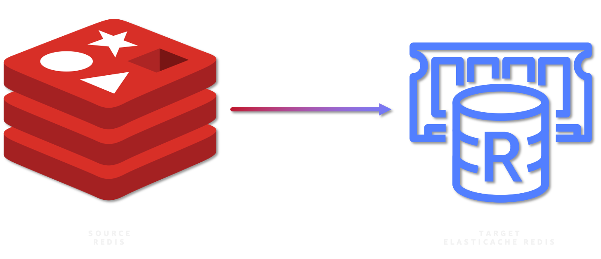
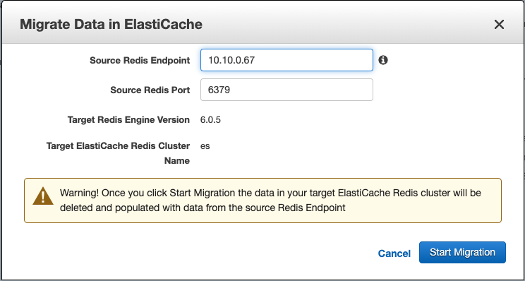
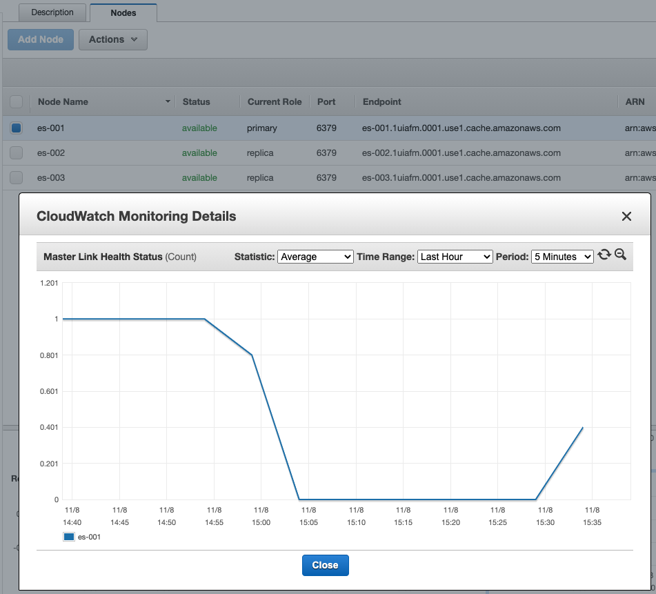

# Migrate your Redis Cache On EC2 To Amazon Elasticache

Mystique Unicorn uses redis to improve the app performance. Currently they are running their redis cache on Amazon EC2 instances. Managing these instances is taking significant effort. Recenly one of their devs discovered that Amazon offers ElastiCachee, a fully managed service for running in-memory data stores with Amazon Web Services (AWS).

Can you help them migrate from Redis Cache On EC2 To Amazon Elasticache?

## 🎯 Solutions

We will follow an multi-stage process to accomplish our goal. We need the following components to get this right,

1. **Source Database - Redis DB**
   - If in AWS: EC2 instance in a VPC, Security Group, SSH Keypair(Optional)
   - Redis Installed
1. **Destination Database - Amazon Elasticache**
   - Subnet Groups
   - VPC Security Groups
1. **Database Migration Service(DMS) - Replication Instance**
   - DMS IAM Roles
   - Endpoints
   - Database Migration Tasks



In this article, we will build an architecture, similar to the one shown above - A simple database running redis instance running on EC2 _(You are welcome to use your own redis instead_). For target we will build a Amazon Elasticache and use DMS to migrate the data.

1.  ## 🧰 Prerequisites

    This demo, instructions, scripts and cloudformation template is designed to be run in `us-east-1`. With few modifications you can try it out in other regions as well(_Not covered here_).

    - 🛠 AWS CLI Installed & Configured - [Get help here](https://youtu.be/TPyyfmQte0U)
    - 🛠 AWS CDK Installed & Configured - [Get help here](https://www.youtube.com/watch?v=MKwxpszw0Rc)
    - 🛠 Python Packages, _Change the below commands to suit your OS, the following is written for amzn linux 2_
      - Python3 - `yum install -y python3`
      - Python Pip - `yum install -y python-pip`
      - Virtualenv - `pip3 install virtualenv`

    As there are a number of components that need to be setup, we will use a combination of Cloudformation(generated from CDK), CLI & GUI.

1.  ## ⚙️ Setting up the environment

    - Get the application code

      ```bash
      git clone https://github.com/miztiik/redis-to-elasticache
      cd redis-to-elasticache
      ```

1.  ## 🚀 Prepare the environment

    We will need cdk to be installed to make our deployments easier. Lets go ahead and install the necessary components.

    ```bash
    # If you DONT have cdk installed
    npm install -g aws-cdk

    # Make sure you in root directory
    python3 -m venv .env
    source .env/bin/activate
    pip3 install -r requirements.txt
    ```

    The very first time you deploy an AWS CDK app into an environment _(account/region)_, you’ll need to install a `bootstrap stack`, Otherwise just go ahead and deploy using `cdk deploy`.

    ```bash
    cdk bootstrap
    cdk ls
    # Follow on screen prompts
    ```

    You should see an output of the available stacks,

    ```bash
    redis-to-elasticache-vpc-stack
    redis-to-elasticache-database-migration-prerequisite-stack
    redis-to-elasticache-redis-on-ec2-stack
    ```

1.  ## 🚀 Deploying the Target Database - Amazon Elasticache

    We can automate the creation of Amazon Elasticache & DMS using CDK, But since this will be the first time we use these services,let us use the Console/GUI to set them up. We can leverage the excellant [documentation from AWS](https://docs.aws.amazon.com/AmazonElastiCache/latest/red-ug/Clusters.Create.CON.Redis.html) on how to setup our Elasticache. (Use your best judgement, as docs tend to change over a period of time)

    Couple of things to note,

    | Parameter                | Value                                                                                      |
    | ------------------------ | ------------------------------------------------------------------------------------------ |
    | Cluster Engine           | Redis                                                                                      |
    | Location                 | Amazon Cloud                                                                               |
    | Name                     | TargetElasticache                                                                          |
    | Node Type                | cache.t2.micro                                                                             |
    | Number of replicas       | 2                                                                                          |
    | Multi-AZ                 | Unchecked                                                                                  |
    | Subnet                   | Create New( From two private subnets of custom VPC `miztiikMigrationVpc`); No Preference   |
    | Security Group           | Choose only `elasticache_db_sg_redis-to-elasticache-database-migration-prerequisite-stack` |
    | Encryption(rest/transit) | Unchecked                                                                                  |

    If any setting is provided here, leave them as defaults. Make a note of the db endpoint. We will use it later.

1.  ## 🚀 Deploying the Source Database

    Let us walk through each of the stacks,

    - **Stack: redis-to-elasticache-vpc-stack**
      This stack will do the following,

      1. Create an custom VPC `miztiikMigrationVpc`(_We will use this VPC to host our source Redis DB, Elasticache_)

      Initiate the deployment with the following command,

      ```bash
      cdk deploy redis-to-elasticache-vpc-stack
      ```

    - **Stack: redis-to-elasticache-database-migration-prerequisite-stack**
      This stack will create the following resources,

      1. Redis, Elasticache & DMS Security groups - (_created during the prerequisite stack_)
      1. DMS IAM Roles - (This stack will **FAIL**, If these roles already exist in your account)
         - `AmazonDMSVPCManagementRole`
         - `AmazonDMSCloudWatchLogsRole`
      1. SSH KeyPair using a custom cfn resource
         - The key material is stored in SSM Parameter Store `mystique-automation-ssh-key`. This key is currently not used to manage the Redis EC2 instance. We will rather use SSM Session Manager

      Initiate the deployment with the following command,

      ```bash
      cdk deploy redis-to-elasticache-database-migration-prerequisite-stack
      ```

      After successful completion, take a look at all the resources and get yourself familiar with them. We will be using them in the future.

    - **Stack: `redis-to-elasticache-redis-on-ec2-stack` Source Database - Redis DB**

      This stack will do the following,

      1. Create an EC2 `m5.large` instance inside our custom VPC(_created during the prerequisite stack_)

      - You can reduce the instance size to suit your needs

      1. Attach security group with Redis port(`6379`) open within the VPC (_For any use-case other than sandbox testing, you might want to restrict it_)

      Initiate the deployment with the following command,

      ```bash
      cdk deploy redis-to-elasticache-redis-on-ec2-stack
      ```

      As our database is a fresh installation, it does not have any data in it. We need some data to migrate. This git repo also includes a `redis_ingestor_and_requestor.py` that will help us to generate some dummy data and insert them to the database. After successful launch of the stack,

      - Connect to the EC2 instance using SSM Session Manager - [Get help here](https://www.youtube.com/watch?v=-ASMtZBrx-k)
      - Switch to privileged user using `sudo su`
      - Navigate to `/var/log`
      - Run the following commands

        ```bash
        cd /var/log
        git clone https://github.com/miztiik/redis-to-elasticache
        cd redis-to-elasticache
        cd redis-to-elasticache/redis_to_elasticache/stacks/back_end/bootstrap_scripts
        ```

      - Edit the file `redis_ingestor_and_requestor.py` to update the `SRC_REDIS_HOST` to your EC2 instance private IP and `TGT_REDIS_HOST` to your elasticache primary endpoint. Sample values are shown below.

        ```bash
        SRC_REDIS_HOST = "10.10.0.67"
        TGT_REDIS_HOST = "es-ro.1uiafm.ng.0001.use1.cache.amazonaws.com"
        ```

      - Execute the file as shown below,

        ```bash
        python3 redis_ingestor_and_requestor.py
        ```

      - You should be able to see some _`id`_ printed out and a summary at the end,
        _Expected Output_,

        ```json
        {"ingesting_to_host":"10.10.0.67"}
        {"host":"10.10.0.67","total_records_ingested":200,"data_ingest_completed":True}
        {"reading_from_host":"10.10.0.67"}
        {"records_retrieval_attempts":10000}
        {"tot_of_records_retrieved":33190}
        {"reading_from_host":"es.1uiafm.ng.0001.use1.cache.amazonaws.com"}
        {"tot_of_records_retrieved":0}
        ```

        If you want to interact with mongodb, you can try out the following commands,

        ```bash
        # Open Redis shell
        redis-cli -h YOUR_REDIS_HOSTNAME
        # Show all Keys
        KEYS *
        # Check Count of Keys
        DBSIZE
        # Delete all Keys
        flushall async
        # Exit
        exit
        ```

      Now we are all done with our source database.

1.  ## 🚀 Live Migration from Redis on EC2 to Amazon Elasticache

    Before we start the migration, We need the private IP address of our Redis instance on Amazon EC2.

    - Navigate to the ElastiCache console to begin your online migration. Choose your _ElastiCache cluster_, and then choose **Migrate Data from Endpoint** in the **Actions** dropdown.
    - In the configuration window that is displayed, enter the p*rivate IP* for Source Redis Endpoint. Then choose **Start Migration**.

      

    - As your Redis cluster starts the migration, it shows a **Status** of **modifying** to indicate it is being added to your existing cluster. After your ElastiCache cluster has successfully connected to your existing Redis instance, you should see a **Status of migrating**.
    - Take a look at the metrics for your primary node. Choose your ElastiCache cluster, which should bring up the nodes for your cluster. Choose the primary node to see the Amazon CloudWatch metrics for the node in the ElastiCache dashboard. Scroll to the **Master Link Health Status** chart. When the value for this chart is at `1`, your ElastiCache instance is caught up with replicating items from your self-managed Redis instance.
      
    - After your clusters have sycned and any application is updated with the new cache enpoint, we are ready for the migration. To do that, choose your ElastiCache cluster in the console, and then **choose Stop Data Migration** in the **Actions** dropdown.
      This removes your ElastiCache node as a replica from your self-managed Redis cluster. When your ElastiCache node has been removed as a replica, it shows a **Status** of **available**.

    _Additional Learnings:_ You can check the logs in cloudwatch for more information or If the online migration is not copying the keys to your fully managed ElastiCache cluster, you can debug the process by choosing **Events** in the navigation pane. The Event page shows you information about your migration, including when it started, when it completed, and if it failed. If your migration failed, this page includes information about the failure

1.  ## 📒 Conclusion

    Here we have demonstrated how to use Amazon Database Migration Service(DMS) to migrate data from Redis DB to Aurora DB.

1.  ## 🎯 Additional Exercises

    - Think about, how to migrate clustered redis caches

1.  ## 🧹 CleanUp

    If you want to destroy all the resources created by the stack, Execute the below command to delete the stack, or _you can delete the stack from console as well_

    - Resources created during [Deploying The Application](#deploying-the-application)
    - Delete CloudWatch Lambda LogGroups
    - _Any other custom resources, you have created for this demo_

    ```bash
    # Delete from cdk
    cdk destroy

    # Follow any on-screen prompts

    # Delete the CF Stack, If you used cloudformation to deploy the stack.
    aws cloudformation delete-stack \
        --stack-name "MiztiikAutomationStack" \
        --region "${AWS_REGION}"
    ```

    This is not an exhaustive list, please carry out other necessary steps as maybe applicable to your needs.

## 📌 Who is using this

This repository aims to teach api best practices to new developers, Solution Architects & Ops Engineers in AWS. Based on that knowledge these Udemy [course #1][103], [course #2][102] helps you build complete architecture in AWS.

### 💡 Help/Suggestions or 🐛 Bugs

Thank you for your interest in contributing to our project. Whether it's a bug report, new feature, correction, or additional documentation or solutions, we greatly value feedback and contributions from our community. [Start here](/issues)

### 👋 Buy me a coffee

[](https://ko-fi.com/Q5Q41QDGK) Buy me a [coffee ☕][900].

### 📚 References

1. [Online Migration to ElastiCache][1]

1. [Performing Online Data Migration Requirements][2]

### 🏷️ Metadata


**Level**: 300

[1]: https://docs.aws.amazon.com/AmazonElastiCache/latest/red-ug/OnlineMigration.html
[2]: https://docs.aws.amazon.com/AmazonElastiCache/latest/red-ug/Migration-Console.html
[100]: https://www.udemy.com/course/aws-cloud-security/?referralCode=B7F1B6C78B45ADAF77A9
[101]: https://www.udemy.com/course/aws-cloud-security-proactive-way/?referralCode=71DC542AD4481309A441
[102]: https://www.udemy.com/course/aws-cloud-development-kit-from-beginner-to-professional/?referralCode=E15D7FB64E417C547579
[103]: https://www.udemy.com/course/aws-cloudformation-basics?referralCode=93AD3B1530BC871093D6
[899]: https://www.udemy.com/user/n-kumar/
[900]: https://ko-fi.com/miztiik
[901]: https://ko-fi.com/Q5Q41QDGK
